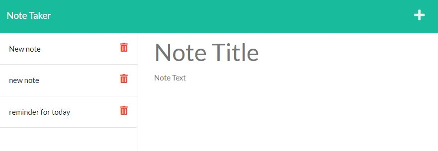

# Node.js Note Taker

## Description

The Note Taker application allows you to easily add and remove notes, with data that persists in a JSON file on the server. It has the following features:

- Node.js backend
- API endpoints and HTML served up by Express.js
- Persistence through a JSON flat file DB

## Table of Contents

- [Description](#description)
- [Installation](#installation)
- [Usage](#usage)
- [License](#license)
- [Contributing](#contributing)

## Installation

- Make sure you have Node.js installed on your system
- Download a zip of the project files
- Unzip the files into a folder of your choice
- Open a terminal window and navigate to the project folder
- Type 'npm i' to install all project dependencies

## Usage

- Type 'npm start' to start the server
- Open a web browser
- Navigate to http://localhost:3001
- Click on the 'Get Started' button to go to the Notes page
- Click the notes on the left to see more info
- Click on the + icon to add a new note
- Click on the trash icon to delete a note

View the live application @ [https://note-taker-40559.herokuapp.com](https://note-taker-40559.herokuapp.com)

### Screenshot

## License

This project is covered under the [GNU General Public License v3.0](https://www.gnu.org/licenses/)

## Contributing

If you'd like to contribute, make a fork of the repository and make changes and then submit a pull request.

## Questions

View my [GitHub Page](https://github.com/JonMooney)

Send me an email @ [jon.mooney@yahoo.com](mailto:jon.mooney@yahoo.com)